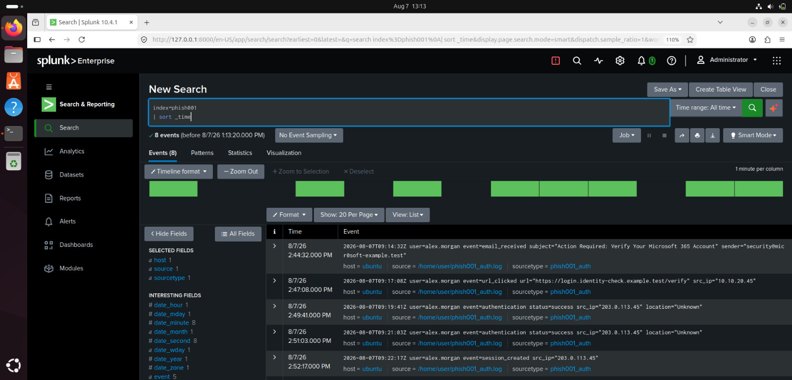
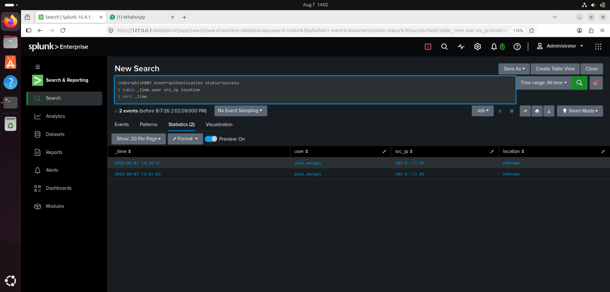
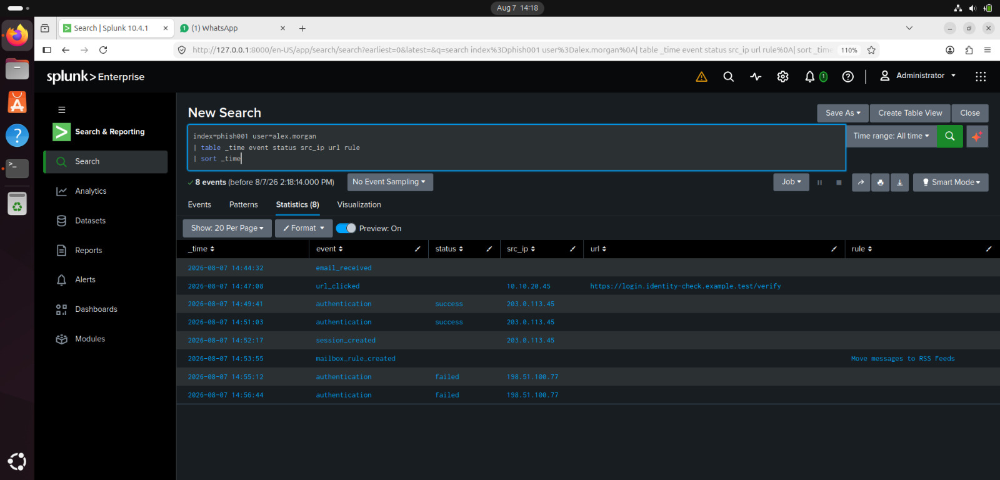
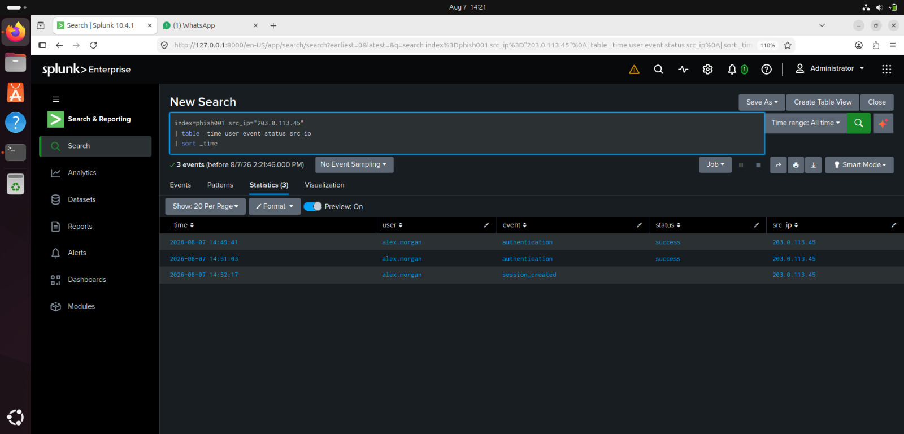
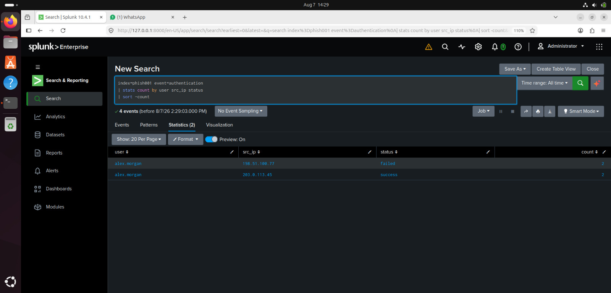
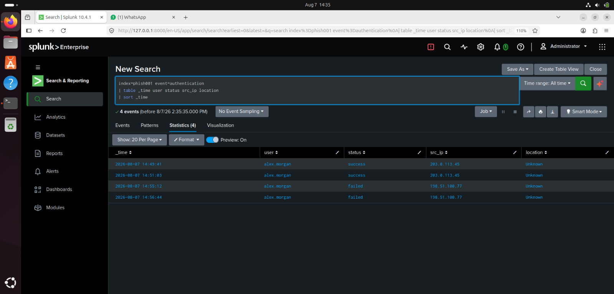

# Splunk Investigation Queries

## Case ID

PHISH-001

## Investigation Objective

Use Splunk to determine whether the phishing email was followed by
suspicious authentication activity. The investigation focuses on identifying
the affected user, authentication activity, source IP addresses, locations,
and other related indicators.

# Query 1 - Find All Case Activity

## Purpose

Identify all available events related to the investigation and establish
the initial timeline of activity.

## Splunk Query

```spl
index=phish001
| sort _time
```

## Screenshot



## Event Details

- Timestamp:  Multiple events returned; review chronologically
- Event Type:  Email and authentication-related events
- Username:  Visible in the returned event data
- Source IP:  Authentication events contain source IP information
- Authentication Status:  Authentication activity is present in the results
- Location:  Available in the authentication event data
- URL / Rule:  Phishing-related email and authentication indicators are present
- Other Relevant Information:  The results establish the initial timeline for the investigation, including the phishing email and subsequent account activity.

## Analyst Analysis

The query returns the available events associated with the PHISH-001
investigation in chronological order.

The results show phishing-related email activity followed by authentication
events. These events provide the initial timeline needed to correlate the
suspected phishing email with subsequent account activity.

The authentication events should be examined further for the affected user,
source IP address, location, and authentication status to determine whether
the activity is suspicious.

---

# Query 2 — Identify Successful Authentication

## Purpose

Identify successful authentication events associated with the investigation.

## Splunk Query

```spl
index=phish001 event=authentication status=success
| table _time user src_ip location
| sort _time
```

## Screenshot



## Event Details

- Timestamp: 2026-08-07 14:49:41 and 2026-08-07 14:51:03
- Username: alex.morgan
- Source IP: 203.0.113.45
- Location: unknown
- Authentication Status: Success
- Authentication Event: Successful authentication
- Other Relevant Information: Two successful authentication events were returned for the affected user.

## Analyst Analysis

This query identified two successful authentication events associated with
the user alex.morgan.

The events occurred at 14:49:41 and 14:51:03 on 2026-08-07. The presence of
multiple successful authentication events provides evidence of account
activity that should be correlated with the phishing timeline.

The source IP address and location should be reviewed in Splunk to determine
whether the authentication activity originated from an expected source.

---
# Query 3 — Investigate User Activity

## Purpose

Review activity associated with the affected user account and identify
authentication or other events that may be related to the phishing incident.

## Splunk Query

```spl
index=phish001 user=alex.morgan
| table _time event status src_ip url rule
| sort _time
```
## Screenshot



## Event Details

- **Event ID:**
- **Timestamp:**
- **Username:**
- **Event Type:**
- **Event Status:**
- **Source IP:**
- **URL:**
- **Detection Rule:**
- **Other Relevant Information:**

## Analyst Analysis

This query focuses the investigation on activity associated with the
affected user account.

The Event ID and timestamp help correlate individual user events with the
phishing activity and authentication events identified in the previous
queries.

Reviewing the source IP, event status, URL, and detection rule can help
determine whether the account shows signs of suspicious activity.

---

# Query 4 — Investigate Source IP Activity

## Purpose

Identify activity associated with a suspicious source IP address.

## Splunk Query

```spl
index=phish001 src_ip="203.0.113.45"
| table _time user event status src_ip
| sort _time
```

## Screenshot



## Event Details

- **Event ID:**
- **Timestamp:**
- **Username:**
- **Source IP:**
- **Event Type:**
- **Authentication Status:**
- **Related Activity:**
- **Other Relevant Information:**

## Analyst Analysis

This query investigates activity associated with the identified source IP
address. Correlating the Event ID, timestamp, username, and authentication
status can help determine whether the IP was involved in multiple related
events.

---

# Query 5 — Authentication Activity by Source IP

## Purpose

Identify authentication activity by user, source IP, and authentication
status.

## Splunk Query

```spl
index=phish001 event=authentication
| stats count by user src_ip status
| sort -count
```

## Screenshot



## Event Details

- **Event ID:**
- **Username:**
- **Source IP:**
- **Authentication Status:**
- **Event Count:**
- **Suspicious Pattern:**
- **Other Relevant Information:**

## Analyst Analysis

This query summarizes authentication activity by user, source IP, and
status. The results can help identify repeated authentication attempts,
successful logins, or unusual authentication patterns.

---

# Query 6 — Authentication Timeline

## Purpose

Create a chronological view of authentication events associated with the
investigation.

## Splunk Query

```spl
index=phish001 event=authentication
| table _time user status src_ip location
| sort _time
```

## Screenshot



## Event Details

- **Event ID:**
- **Timestamp:**
- **Username:**
- **Authentication Status:**
- **Source IP:**
- **Location:**
- **Relationship to Phishing Event:**
- **Other Relevant Information:**

## Analyst Analysis

This query provides a chronological view of authentication activity. The
Event ID and timestamp help establish the sequence of events and determine
whether suspicious authentication occurred after the phishing activity.

---

# Investigation Findings

## Key Findings

- **Phishing Activity:**
- **Affected User:**
- **Successful Authentication:**
- **Suspicious Source IP:**
- **Geographic Information:**
- **Important Event IDs:**
- **Important Timeline Events:**

## Final Assessment

**Case Status:** [Confirmed Compromise / Suspicious Activity / No Evidence of Compromise]

**Affected User:** [User]

**Suspicious Source IP:** [IP Address]

**Primary Event ID:** [Event ID]

**Primary Evidence:** [Important evidence identified from Splunk]

**Recommended Action:** [Recommended response]

---

# Conclusion

The investigation used Splunk to correlate phishing-related activity with
authentication events, user activity, source IP addresses, Event IDs, and
timestamps.

The final conclusion should be based on the evidence observed in the Splunk
screenshots and the corresponding event analysis documented above.

