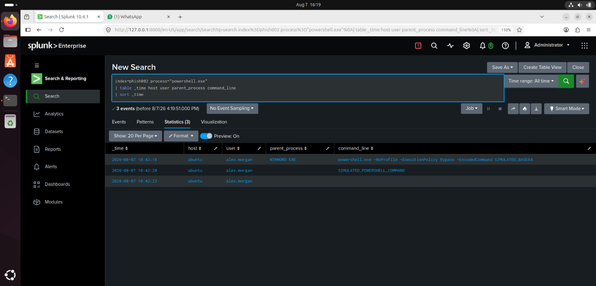
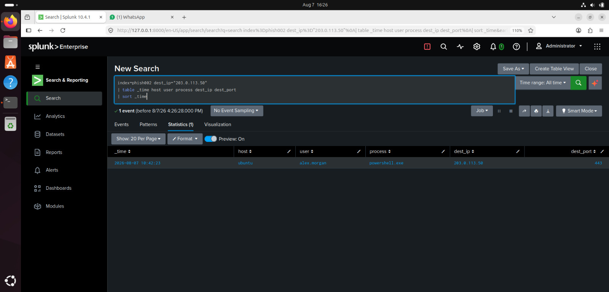
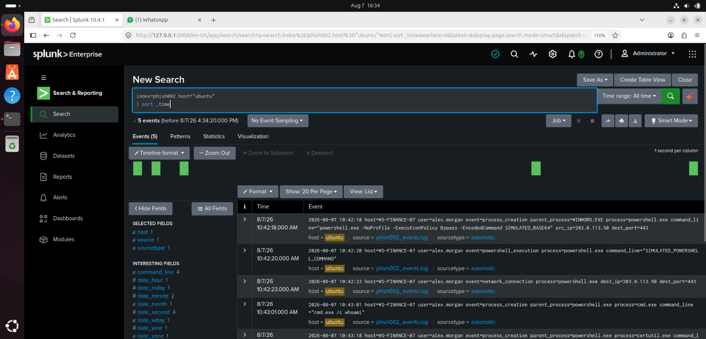

# PHISH-002 — Splunk Investigation

**Case ID:** PHISH-002  
**Investigation:** Suspicious PowerShell Activity  
**SIEM:** Splunk  
**Status:** Investigation in Progress

## Investigation Objective

Determine whether the suspicious PowerShell execution represents malicious activity or a potential endpoint compromise.

The investigation will correlate process execution, PowerShell activity, network indicators, and related endpoint events.

---

# Query 1 — Find PowerShell Activity

## Splunk Query

```spl
index=phish002 powershell
| table _time host user parent_process process command_line
| sort _time
```

## Evidence


## What the Events Show

The Splunk events show **suspicious PowerShell activity** on the host.

- **User:** `alex.morgan`
- Multiple executions of `powershell.exe`
- PowerShell was executed with suspicious options:
  - `-NoProfile`
  - `-ExecutionPolicy Bypass`
  - `-EncodedCommand`
- A simulated PowerShell command was executed.
- `cmd.exe /c whoami` was used to identify the current user.
- `certutil.exe` was used with `-urlcache -split -f` to download a file from an external URL.

## Analyst Observation

The activity is **suspicious and potentially malicious**.

The combination of **ExecutionPolicy Bypass**, **EncodedCommand**, user discovery using `whoami`, and the use of **certutil.exe for downloading a file** are common indicators of attacker activity.

## Investigation Decision

**Decision: Escalate for further investigation.**

The analyst should:

1. Decode and analyze the PowerShell `EncodedCommand`.
2. Investigate the URL and file associated with `certutil.exe`.
3. Check for persistence mechanisms and additional processes.
4. Review authentication and endpoint logs for `alex.morgan`.
5. Confirm whether this activity was authorized or part of a security simulation.

**Overall Assessment:**  
> Suspicious PowerShell execution with potential payload download. The activity should be investigated further as a potential security incident.
---

# Query 2 — Investigate the Suspicious Host

## Splunk Query

```spl
index=phish002 
| table _time user event parent_process process command_line
| sort _time
```

## Evidence


## What the Events Show

The Splunk results show **5 suspicious events** involving the user `alex.morgan`:

1. `powershell.exe` executed with `-NoProfile`, `-ExecutionPolicy Bypass`, and `-EncodedCommand`.
2. A PowerShell command was executed.
3. A network connection was initiated by `powershell.exe`.
4. `cmd.exe /c whoami` was executed for user discovery.
5. `certutil.exe` was used with `-urlcache -split -f` to retrieve `update.txt` from an external URL.

## Analyst Observation

The activity is **suspicious and potentially malicious**. The use of PowerShell with **Execution Policy Bypass** and an **Encoded Command**, followed by `whoami` and `certutil.exe` network activity, indicates possible command execution, discovery, and payload retrieval.

## Investigation Decision

**Escalate for further investigation.**

The analyst should:

- Decode and analyze the PowerShell `EncodedCommand`.
- Investigate the external URL and downloaded `update.txt` file.
- Review the network connection associated with `powershell.exe`.
- Check for additional processes, persistence, or follow-up activity.
- Verify whether the activity was authorized or part of a security simulation.

**Final Assessment:** The events are consistent with **suspicious PowerShell activity and possible payload download**, so the incident should be investigated further.

# Query 3 — Investigate PowerShell Command-Line Activity

## Splunk Query

```spl
index=phish002 process="powershell.exe"
| table _time host user parent_process command_line
| sort _time
```

## Evidence



## What the Events Show

The Splunk results show **3 PowerShell-related events** for user `alex.morgan`:

1. `powershell.exe` was created with:
   - `-NoProfile`
   - `-ExecutionPolicy Bypass`
   - `-EncodedCommand SIMULATED_BASE64`
2. A `powershell_execution` event occurred with `SIMULATED_POWERSHELL_COMMAND`.
3. A `network_connection` event was generated by `powershell.exe`.

##  Analyst Observation

The activity is **suspicious** because PowerShell was executed with **Execution Policy Bypass** and an **Encoded Command**. The subsequent PowerShell execution and network connection indicate that the PowerShell process performed additional activity.

##  Investigation Decision

**Escalate for further investigation.**

The analyst should:

- Decode and review the encoded PowerShell command.
- Investigate the network connection made by `powershell.exe`.
- Check for additional child processes or downloaded files.
- Determine whether the activity was authorized or part of a security simulation.

**Final Assessment:**  
The events indicate **suspicious PowerShell execution with encoded commands and network activity**, requiring further investigation.

# Query 4 — Investigate Network Indicator

## Splunk Query

```spl
index=phish002 dest_ip="203.0.113.50"
| table _time host user process dest_ip dest_port
| sort _time
```

## Evidence



##  What the Events Show

The Splunk results show **one network connection** from `powershell.exe` run by user `alex.morgan`.

- **Host:** `ubuntu`
- **User:** `alex.morgan`
- **Process:** `powershell.exe`
- **Destination IP:** `203.0.113.59`
- **Destination Port:** `443`

## Analyst Observation

The PowerShell process established an **HTTPS connection to `203.0.113.59` on port 443**.

This is suspicious when considered with the earlier evidence of **Encoded PowerShell** and **Execution Policy Bypass**. The connection could indicate communication with an external server or retrieval of a payload.

## Investigation Decision

**Escalate for further investigation.**

The analyst should:

- Investigate the destination IP `203.0.113.59`.
- Review the PowerShell command that initiated the connection.
- Check for downloaded files or additional network connections.
- Correlate this event with the previous PowerShell execution events.

**Final Assessment:**  
The evidence shows **PowerShell communicating with an external IP over HTTPS**, which strengthens the suspicion of potentially malicious PowerShell activity.

# Query 5 — Correlate the Complete Host Activity

## Splunk Query

```spl
index=phish002 host="ubuntu"
| sort _time
```

## Evidence



# What the Events Show

The Splunk results show **5 events** related to suspicious PowerShell activity by `alex.morgan` on host `WS-FINANCE-07`.

- `powershell.exe` was executed with `-NoProfile`, `-ExecutionPolicy Bypass`, and `-EncodedCommand`.
- A `powershell_execution` event shows `SIMULATED_POWERSHELL_COMMAND`.
- `powershell.exe` made a network connection to `203.0.113.59` on port `443`.
- `cmd.exe /c whoami` was executed for user discovery.
- `certutil.exe` was subsequently executed from the PowerShell process.

# Analyst Observation

The sequence of events is **suspicious**. PowerShell was run with an execution-policy bypass and encoded command, followed by network communication and discovery activity. The use of `certutil.exe` also warrants investigation because it can be used to retrieve files from a remote location.

# Investigation Decision

**Escalate for further investigation.**

The analyst should:

1. Decode and analyze the PowerShell encoded command.
2. Investigate the connection to `203.0.113.59:443`.
3. Examine the `certutil.exe` command and determine what file was retrieved.
4. Review additional process and network activity from `alex.morgan`.
5. Confirm whether the activity was authorized or part of the simulated investigation.

**Final Assessment:**  
The event sequence is consistent with **suspicious PowerShell execution, network communication, discovery activity, and potential payload retrieval**.

# Investigation Timeline

| Time | Event | Host | User | Finding |
|---|---|---|---|---|
| TBD | PowerShell execution | TBD | TBD | TBD |
| TBD | Suspicious command | TBD | TBD | TBD |
| TBD | Network connection | TBD | TBD | TBD |
| TBD | Additional activity | TBD | TBD | TBD |

---

# Final Analyst Assessment

**Status:** Investigation in Progress

The final assessment will be based on correlated Splunk evidence.

The investigation will determine whether the PowerShell activity represents:

- Legitimate administrative activity
- Suspicious activity
- Confirmed malicious activity
- Potential endpoint compromise

---

# Recommended Response

To be completed after the investigation.

Potential response actions may include:

- Isolate the affected endpoint
- Review the PowerShell command
- Investigate related processes
- Investigate network connections
- Identify additional affected hosts
- Preserve relevant evidence
- Escalate the incident if compromise is confirmed

---

> All data in this project is fictional and created for cybersecurity training.
