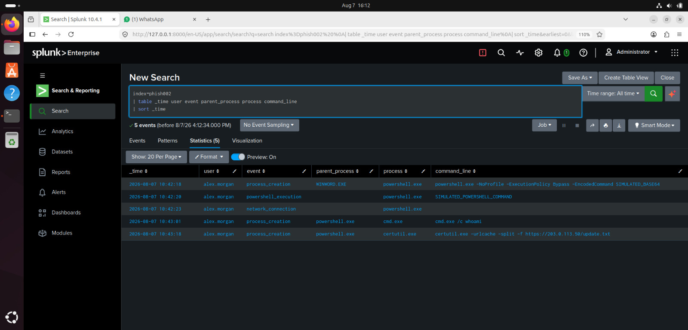

# PHISH-002 — Splunk Investigation

**Case ID:** PHISH-002  
**Investigation:** Suspicious PowerShell Activity  
**SIEM:** Splunk  
**Status:** Investigation in Progress

## Investigation Objective

Determine whether the suspicious PowerShell execution represents malicious activity or a potential endpoint compromise.

The investigation will correlate process execution, PowerShell activity, network indicators, and related endpoint events.

---

# Query 1 — Find PowerShell Activity

## Splunk Query

```spl
index=phish002 powershell
| table _time host user parent_process process command_line
| sort _time
```

## Evidence


## What the Events Show

The Splunk events show **suspicious PowerShell activity** on the host.

- **User:** `alex.morgan`
- Multiple executions of `powershell.exe`
- PowerShell was executed with suspicious options:
  - `-NoProfile`
  - `-ExecutionPolicy Bypass`
  - `-EncodedCommand`
- A simulated PowerShell command was executed.
- `cmd.exe /c whoami` was used to identify the current user.
- `certutil.exe` was used with `-urlcache -split -f` to download a file from an external URL.

## Analyst Observation

The activity is **suspicious and potentially malicious**.

The combination of **ExecutionPolicy Bypass**, **EncodedCommand**, user discovery using `whoami`, and the use of **certutil.exe for downloading a file** are common indicators of attacker activity.

## Investigation Decision

**Decision: Escalate for further investigation.**

The analyst should:

1. Decode and analyze the PowerShell `EncodedCommand`.
2. Investigate the URL and file associated with `certutil.exe`.
3. Check for persistence mechanisms and additional processes.
4. Review authentication and endpoint logs for `alex.morgan`.
5. Confirm whether this activity was authorized or part of a security simulation.

**Overall Assessment:**  
> Suspicious PowerShell execution with potential payload download. The activity should be investigated further as a potential security incident.
---

# Query 2 — Investigate the Suspicious Host

## Splunk Query

```spl
index=phish002 
| table _time user event parent_process process command_line
| sort _time
```

## Evidence



## What the Events Show

To be completed after reviewing the Splunk results.

## Analyst Observation

To be completed from the actual evidence.

## Investigation Decision

To be completed after reviewing the results.

---

# Query 3 — Investigate PowerShell Command-Line Activity

## Splunk Query

```spl
index=phish002 process="powershell.exe"
| table _time host user parent_process command_line
| sort _time
```

## Evidence

Screenshot will be added after running the query.

## What the Events Show

To be completed after reviewing the Splunk results.

## Analyst Observation

To be completed from the actual evidence.

## Investigation Decision

To be completed after reviewing the results.

---

# Query 4 — Investigate Network Indicator

## Splunk Query

```spl
index=phish002 dest_ip="203.0.113.50"
| table _time host user process dest_ip dest_port
| sort _time
```

## Evidence

Screenshot will be added after running the query.

## What the Events Show

To be completed after reviewing the Splunk results.

## Analyst Observation

To be completed from the actual evidence.

## Investigation Decision

To be completed after reviewing the results.

---

# Query 5 — Correlate the Complete Host Activity

## Splunk Query

```spl
index=phish002 host="WS-FINANCE-07"
| sort _time
```

## Evidence

Screenshot will be added after running the query.

## What the Events Show

To be completed after reviewing the Splunk results.

## Analyst Observation

To be completed from the actual evidence.

## Investigation Decision

To be completed after reviewing the results.

---

# Investigation Timeline

| Time | Event | Host | User | Finding |
|---|---|---|---|---|
| TBD | PowerShell execution | TBD | TBD | TBD |
| TBD | Suspicious command | TBD | TBD | TBD |
| TBD | Network connection | TBD | TBD | TBD |
| TBD | Additional activity | TBD | TBD | TBD |

---

# Final Analyst Assessment

**Status:** Investigation in Progress

The final assessment will be based on correlated Splunk evidence.

The investigation will determine whether the PowerShell activity represents:

- Legitimate administrative activity
- Suspicious activity
- Confirmed malicious activity
- Potential endpoint compromise

---

# Recommended Response

To be completed after the investigation.

Potential response actions may include:

- Isolate the affected endpoint
- Review the PowerShell command
- Investigate related processes
- Investigate network connections
- Identify additional affected hosts
- Preserve relevant evidence
- Escalate the incident if compromise is confirmed

---

> All data in this project is fictional and created for cybersecurity training.
