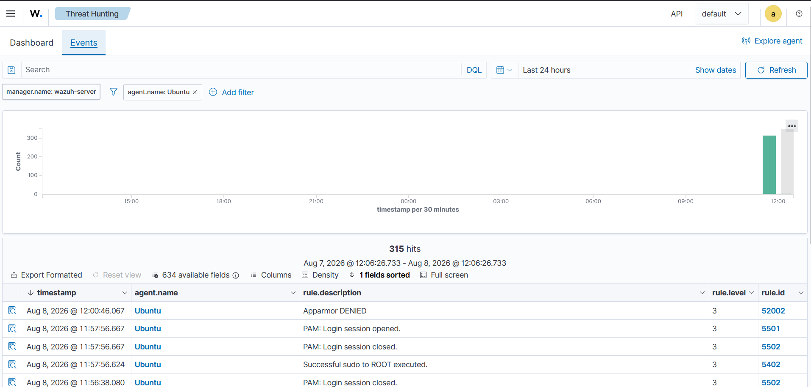

# Event Analysis

## Investigation ID

BRUTE-001

## Event Summary

A controlled SSH authentication test was performed from the Kali Linux machine against the Ubuntu monitored host.

The test generated failed SSH authentication events that were recorded by Ubuntu and detected by Wazuh.

## Source

- Host: Kali Linux
- IP Address: `192.168.1.184`

## Target

- Host: Ubuntu
- IP Address: `192.168.1.4`
- Service: SSH

## Authentication Attempt

The following test command was used:

`ssh invaliduser@192.168.1.4`

An incorrect password was entered during the controlled test.

## Authentication Log Evidence

Ubuntu recorded the following events:

`Invalid user invaliduser from 192.168.1.184`

`pam_unix(sshd:auth): authentication failure`

`Failed password for invalid user invaliduser from 192.168.1.184`

`Connection closed by invalid user invaliduser 192.168.1.184`

## Wazuh Detection

Wazuh detected the authentication activity using:

- Rule ID: `5710`
- Rule Level: `5`
- Rule Description: `sshd: Attempt to login using a non-existent user`

## Wazuh Search

The following search was used in Wazuh:

`"Failed password"`

The Ubuntu agent was selected as the event source.

## Timeline

| Time | Event |
|---|---|
| 11:56:10 | Invalid SSH user detected |
| 11:56:13 | SSH authentication failure |
| 11:56:16 | Failed password |
| 11:56:20 | Failed password |
| 11:56:22 | SSH connection closed |

## Investigation Findings

| Investigation Item | Finding |
|---|---|
| Source Host | Kali Linux |
| Source IP | `192.168.1.184` |
| Target Host | Ubuntu |
| Target IP | `192.168.1.4` |
| Service | SSH |
| Username | `invaliduser` |
| Event Type | Failed Authentication |
| Wazuh Rule ID | `5710` |
| Wazuh Rule Level | `5` |
| Detection | Attempt to login using a non-existent user |

## Analysis

The events show multiple failed SSH authentication attempts originating from `192.168.1.184` against the Ubuntu host at `192.168.1.4`.

Wazuh successfully collected and detected the authentication activity.

The activity is consistent with suspicious authentication behavior. However, because this was a controlled laboratory test, it should not be classified as a confirmed real-world brute-force attack.

## MITRE ATT&CK Mapping

- Technique: `T1110 — Brute Force`

The technique is relevant because repeated authentication failures can indicate credential-guessing activity.

## Key Investigation Questions

### Which account was targeted?

`invaliduser`

### Which host was targeted?

Ubuntu — `192.168.1.4`

### What was the source IP?

`192.168.1.184`

### What protocol was involved?

SSH

### Which Wazuh rule detected the activity?

Rule `5710`

### What was the Wazuh rule description?

`sshd: Attempt to login using a non-existent user`

### What was the Wazuh rule level?

Level `5`

### Was a successful login confirmed?

No successful login was confirmed as part of this controlled test.

### Was this a confirmed real-world brute-force attack?

No. This was a controlled authentication test performed inside an authorized cybersecurity laboratory.

## Recommended SOC Response

If similar activity occurred in a production environment, the SOC could:

1. Investigate the source IP address.
2. Review all authentication events from the source.
3. Check whether valid accounts were targeted.
4. Check for successful authentication following failed attempts.
5. Review activity across other monitored hosts.
6. Determine whether blocking the source IP is appropriate according to organizational policy.
7. Review affected user accounts.
8. Reset credentials if compromise is suspected.
9. Escalate the incident according to the organization's incident response procedure.

## Conclusion

The Wazuh detection pipeline successfully identified the controlled SSH authentication activity.

The investigation confirmed that Kali Linux at `192.168.1.184` generated failed SSH authentication attempts against Ubuntu at `192.168.1.4`.

Wazuh detected the activity using rule `5710` with severity level `5`.

The test successfully demonstrated the SOC workflow of generating authentication telemetry, collecting events with Wazuh, identifying the source and target, analyzing the detection, mapping the activity to MITRE ATT&CK, and documenting the findings.

## Evidence

The Wazuh Dashboard screenshot is stored at:

`../evidence/wazuh-ssh-failed-login.png`

## Lab Disclaimer

This investigation was performed in an authorized cybersecurity laboratory using controlled test activity.

No unauthorized systems were targeted.

All testing and evidence collection were performed for educational and defensive security purposes.
