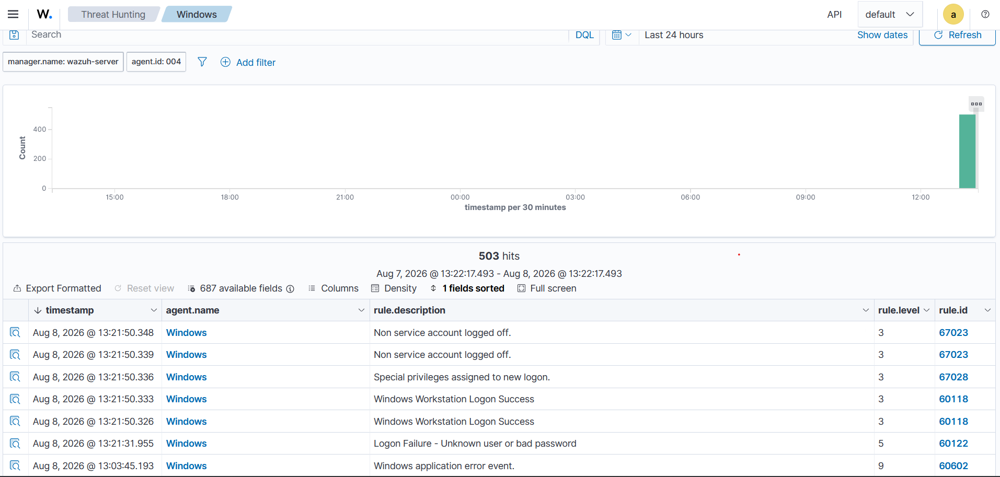

# Windows Failed Logon Investigation

## Overview

- **Event Type:** Failed Windows Logon
- **Windows Event ID:** 4625
- **Operating System:** Windows
- **Agent ID:** 004
- **Agent Name:** Windows
- **Detection Platform:** Wazuh
- **Authentication Result:** Failed
- **Purpose:** Controlled SOC lab investigation

## Investigation Evidence

The following screenshot shows a Windows failed-logon event detected and displayed by Wazuh.

The Wazuh Events view contains the following relevant event:

- **Event Description:** Logon Failure – Unknown user or bad password
- **Agent:** Windows
- **Agent ID:** 004
- **Windows Event ID:** 4625
- **Event Type:** Failed Logon
- **Result:** Authentication failed

## Analysis

Windows Event ID 4625 indicates that a logon attempt failed. In this lab, Wazuh successfully collected the Windows security event and displayed it in the Events view.

The event description **"Logon Failure – Unknown user or bad password"** indicates that the authentication attempt was unsuccessful because the supplied account information was not accepted.

## SOC Relevance

A failed Windows logon can be caused by:

- Incorrect credentials
- An incorrect username
- A mistyped password
- An expired or disabled account
- Repeated authentication attempts that may require further investigation

For a SOC analyst, repeated Event ID 4625 alerts from the same source or against the same account should be investigated for possible brute-force or password-spraying activity.

## Evidence

**Evidence:** Wazuh Events dashboard showing the Windows failed-logon event.
